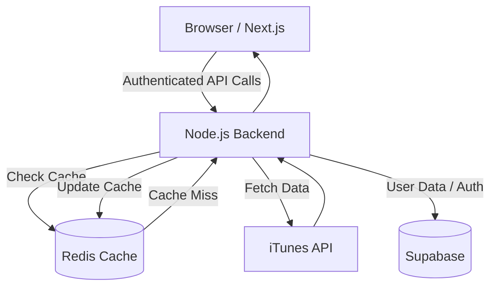

# Aura Music: Engineering Handbook & System Architecture

Aura Music is a high-performance music streaming application featuring a decoupled Next.js frontend and a Node.js/Express backend. This document serves as the authoritative guide to the system's architecture, design decisions, and implementation details.

---

## 1. Project Overview

### Purpose
Aura Music provides a seamless, high-fidelity music search and playback experience. It focuses on speed, responsiveness, and a premium "neon-retro" aesthetic, allowing users to discover curated tracks and manage personal music libraries.

### Core Features
- **Global Search**: High-speed track search powered by the iTunes API.
- **Synced Playback**: 30-second high-quality audio previews with a persistent player across the app.
- **Personal Library**: Create, manage, and share custom playlists.
- **Liked Songs**: Quick-save favorite tracks with instant synchronization.
- **Auth Integration**: Secure user accounts managed via Supabase Auth.

### Technology Stack
- **Frontend**: Next.js 15 (App Router), React 19, TypeScript, Tailwind CSS 4, Zustand, Lucide Icons.
- **Backend**: Node.js, Express 5, ioredis (Caching Client), tsx.
- **Data**: Supabase (Postgres + Auth).
- **External API**: iTunes Search API.

---

## 2. System Architecture

Aura Music utilizes a **Separated Frontend–Backend Architecture** to ensure clear separation of concerns and independent scalability.

### Request Flow Diagram


### Design Decisions
- **Separated Backend**: Originally integrated, the backend was decoupled to allow the frontend to remain slim and focused on UI/UX while the backend handles complex business logic, caching, and database interaction.
- **Administrative Access**: The backend uses the Supabase Service Role Key, allowing it to perform administrative operations while enforcing business rules in code rather than SQL policies alone.

---

## 3. Frontend Architecture

The frontend is built on **Next.js 15** using the **App Router**, prioritizing server-side rendering where possible and client-side interactivity where needed.

### Structure
- `app/`: Contains the main layout and entry points.
  - `layout.tsx`: The root wrapper providing the `AuthProvider` and global font/styles.
  - `page.tsx`: The primary application shell. It manages the central state for playback, active views, and global search results.
- `components/`: Modular UI units.
  - **Sidebar**: Manages navigation and user playlists.
  - **TopNav**: Global search bar and user profile/authentication status.
  - **TrackCard**: Individual track display (Grid view).
  - **TrackList / TrackTable**: List containers that switch between Grid and List views.
  - **NowPlayingBar**: Persistent audio controller managing the HTML5 Audio state.
  - **Auth**: Modals and overlays for Supabase auth flows.

### State Management & Playback
The app uses **Zustand** for centralized state management, eliminating complex prop-drilling and ensuring consistent behavior across the application.
- **`usePlaybackStore`**: Manages the current track, playback list, and a global `HTMLAudioElement`. Components subscribe to this store for playback status and control actions.
- **`useLibraryStore`**: Handles user playlists, liked songs, and optimistic updates for library modification.
- **Playback Logic**: The `NowPlayingBar` and other components interact with the store's audio object directly. When a track is selected, the store updates the audio source and manages the play/pause cycle.

---

## 4. Backend Architecture

The backend is a robust **Express** server designed for speed and reliability.

### File Structure
- `src/index.ts`: The main entry point initializing middleware (CORS, JSON) and routes.
- `src/routes/`: Route definitions for Music, Library, and Playlists.
- `src/controllers/`: Maps HTTP requests to service calls.
- `src/services/`: Pure business logic (iTunes fetching, Supabase queries).
- `src/config/`: Configuration for Supabase and Redis.

### Logic Flow
1. **Middleware**: All protected routes pass through `auth.ts`, which verifies the Supabase JWT.
2. **Services**: `itunes.service.ts` handles the API handshake, while `library.service.ts` manages database persistence.

---

## 5. Redis Caching Strategy

To ensure rapid response times and minimize external API hits, Aura Music integrates **Redis**.

- **Why Redis?**: iTunes API responses can vary in latency. Caching popular searches ensures a sub-50ms response time for repeat queries.
- **Pattern**: Implements a "Cache-Aside" pattern with a fallback mechanism if Redis is unavailable.
- **Cache Keys**: Format: `music:search:{query}`.
- **Expiration**: Results are cached for 1 hour (`TTL = 3600`), providing a `source` field in the response (`cache` or `network`).
- **Flow**:
  1. Frontend sends search query.
  2. Backend checks Redis for the key.
  3. If found, returns immediately.
  4. If not, fetches from iTunes, saves to Redis, and returns.

---

## 6. Supabase Integration

### Authentication
The frontend uses `@supabase/ssr` to manage user sessions. The `access_token` is sent in the `Authorization: Bearer` header to the backend on every request.

### Database Schema
Aura Music uses three primary tables:
- **`liked_songs`**: Links `user_id` to `track_id`. Stores the full `track_data` as JSONB for instant retrieval without re-fetching from iTunes.
- **`playlists`**: Metadata for user-created collections (`name`, `description`).
- **`playlist_songs`**: Junction table linking `playlists` to `tracks`. Includes a `position` column for custom ordering and a unique constraint on `(playlist_id, track_id)`.

---

## 7. Music Playback System

### Technical Implementation
The system leverages a centralized `Audio` object within the Zustand store.
1. **Selection**: User clicks a track. `setTrack` is called on the store.
2. **Initialization**: The global `audio` object updates its `src` to the 30-second AAC preview URL and starts playback.
3. **Synchronization**: The `NowPlayingBar` subscribes to store events, managing volume, seeking, and playback state (`playing` vs `paused`) without needing to be a child of the player container.
4. **Resilience**: The system tracks playback errors and provides clear UI feedback if a stream fails to load.

---

## 8. Important Engineering Decisions

- **Why separate backend?** Security and Caching. We needed a place to hide the `SERVICE_ROLE_KEY` and host a Redis instance, which isn't possible in a pure client-side architecture.
- **Why JSONB for track data?** To avoid complex relational mapping for external API data that we don't own. Storing the iTunes object as-is allows us to render library tracks identical to search results without overhead.

---

## 9. Developer Guide

### Local Setup
1. **Backend**: 
   ```bash
   cd auramusic-backend
   pnpm install
   pnpm dev
   ```
2. **Frontend**:
   ```bash
   cd my-next-enterprise
   pnpm install
   pnpm dev
   ```

### Environment Variables
- `NEXT_PUBLIC_SUPABASE_URL`: Supabase project URL.
- `NEXT_PUBLIC_SUPABASE_ANON_KEY`: Client-side anon key.
- `SUPABASE_SERVICE_ROLE_KEY`: (Backend only) Admin access key.
- `REDIS_URL`: URL for the Redis instance.

---

## 10. Core System Files

A quick reference guide to locating files by functional area.

### Search
- **Frontend**: `app/page.tsx`, `components/SearchBar/SearchBar.tsx`, `components/TopNav/TopNav.tsx`, `lib/itunes.ts`
- **Backend**: `src/routes/music.routes.ts`, `src/controllers/music.controller.ts`, `src/services/itunes.service.ts`

### Playback
- **Frontend**: `app/page.tsx` (State Controller), `components/NowPlayingBar/NowPlayingBar.tsx` (UI Controller), `components/TrackCard/TrackCard.tsx`, `components/TrackList/TrackTable.tsx`
- **Backend**: iTunes integration via `itunes.service.ts`

### Auth
- **Frontend**: `components/Providers/AuthProvider.tsx`, `components/Auth/AuthOverlay.tsx`, `lib/supabase/client.ts`, `lib/supabase/middleware.ts`, `lib/supabase/server.ts`
- **Backend**: `src/middleware/auth.ts`, `src/config/supabase.ts`

### Library & Liked Songs
- **Frontend**: `lib/actions/liked-songs.ts`, `lib/types.ts`
- **Backend**: `src/routes/library.routes.ts`, `src/controllers/library.controller.ts`, `src/services/library.service.ts`

### Playlists
- **Frontend**: `lib/actions/playlists.ts`, `components/Playlist/CreatePlaylistModal.tsx`, `components/Sidebar/Sidebar.tsx`
- **Backend**: `src/routes/playlist.routes.ts`, `src/controllers/playlist.controller.ts`, `src/services/playlist.service.ts`

### Redis Caching
- **Backend**: `src/config/redis.ts`, `src/controllers/music.controller.ts`

---

## 11. Future Improvements
- **Recommendation Engine**: Use stored `liked_songs` JSONB data to suggest similar genres via backend ML worker.
- **Full Track Streaming**: Integration with a full-length streaming provider.
- **Offline Cache**: PWA support for caching audio blobs in IndexedDB.

---
*Generated by Aura Music Engineering Team — March 2026*
